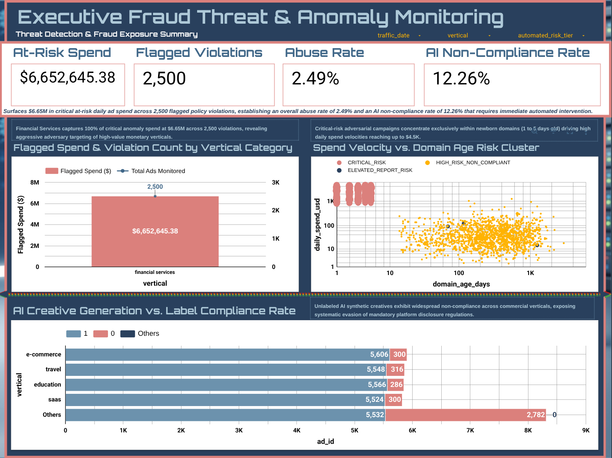
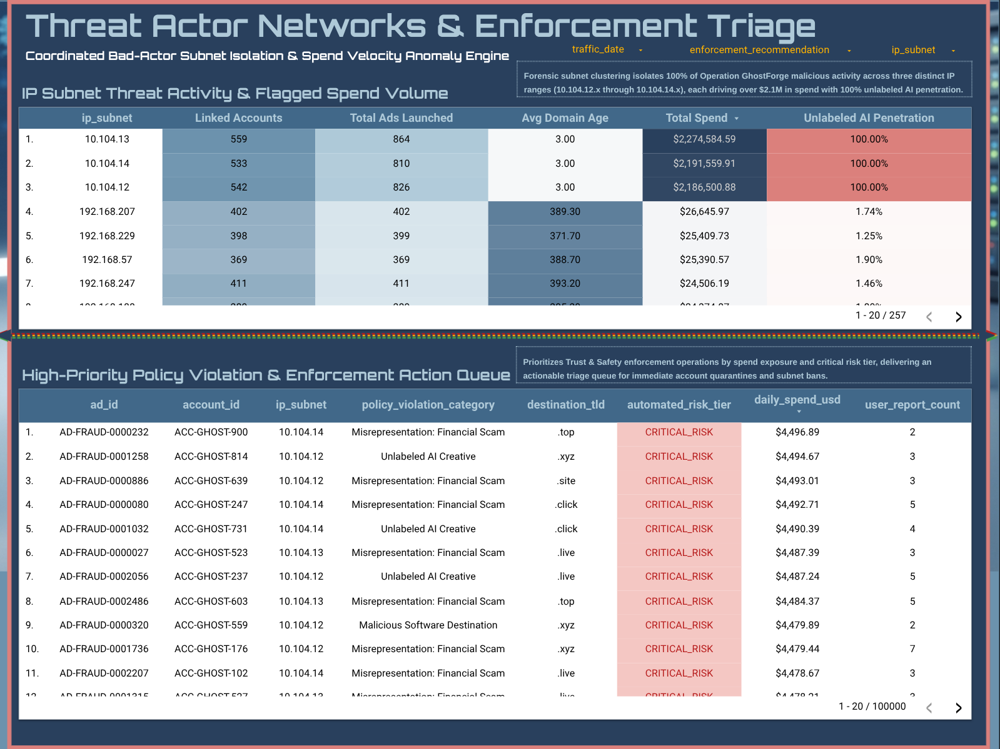

# Google Ads Content Safety Analysis: AI-Generated Scam Network Detection & Enforcement Framework

## Executive Overview
Following Google’s July 2026 Ads Terms of Service update and global regulatory mandates (including EU AI Act Article 50 transparency requirements), mandatory labeling of AI-generated content was expanded across Search, Display, and Performance Max. While generative AI tools empower legitimate businesses, coordinated cybercrime syndicates ("Operation GhostForge") exploit LLM creative engines to rapidly auto-generate deceptive financial scam creatives (e.g., crypto recovery schemes, imposter government notices, and tech support fraud).

This repository provides an enterprise-grade analytics infrastructure and enforcement framework developed for the **Analyst, Content Safety** role at Google Ads. It operationalizes high-scale SQL data warehousing, Python-based statistical anomaly modeling, and escalation triaging to detect, score, and mitigate ephemeral scam networks without disrupting legitimate advertiser experience.

---

## Infrastructure & Technical Stack
* **Target Ecosystem:** Google Ads (Search, Display, Performance Max, YouTube)
* **Data Warehouse:** Google BigQuery (Project ID: `driiiportfolio`, Dataset: `trust_and_safety_ops`)
* **Analytics & Modeling:** Python 3.10+, Pandas, NumPy, SciPy, Seaborn, Matplotlib (Google Colab Environment)
* **Business Intelligence:** Looker Studio Threat Dashboard
* **Repository Architecture:** SQL DDL/DML, Modular Python Scripts, Executive Documentation

---

## Content Safety Operational Workflow
The framework enforces a systematic 6-step Trust and Safety operational lifecycle:
1. **Surveillance & Intake:** Continuous monitoring of on-call queues, user report spikes, and mandatory AI label compliance.
2. **Deep-Dive Investigation:** Forensic linkage across shared IP subnets, TLD registration ages, and financial spend velocity.
3. **Forensic Data Analytics:** BigQuery multi-CTE script execution quantifying abuse penetration and ecosystem risk exposure.
4. **Strategic Influence:** Executive trade-off proposals aligning Product Management, Engineering, Global Sales Organization (GSO), and Legal.
5. **Scalable Enforcement:** Automated composite risk scoring triggering SLA-tiered account suspensions and manual review flags.
6. **Automation Optimization:** Continuous feedback loops updating algorithmic detection thresholds and reducing false positives.

---

## Operation GhostForge_Ad Fraud & Policy Enforcement Intelligence Dashboard
* Opening - `Intro`
* Page 1 - `Executive Fraud Threat & Anomaly Monitoring`
  
* Page 2 - `Threat Actor Networks & Enforcement Triage`
  
* Closing - `Outro`

---

## Repository Directory Map
* `sql/01_ddl_table_optimization_and_cleaning.sql`: BigQuery production table creation with date partitioning, clustering, and automated risk tiering.
* `sql/02_forensic_network_cluster_analysis.sql`: Multi-CTE forensic query isolating coordinated bad actor subnets bypassing keyword filters.
* `notebooks/01_synthetic_data_generation.py`: Python simulation script generating 100,000 ad traffic records with embedded fraud anomalies.
* `notebooks/02_statistical_anomaly_detection.py`: Z-Score statistical model calculating composite risk scores and plotting spend velocity vs. domain age.
* `documentation/`: Job alignment matrices, RACI decision frameworks, SLA triaging protocols, and cross-functional executive memos.
* `visualization/`: Looker Studio layout, metric definitions, and threat monitoring dashboard specifications.
